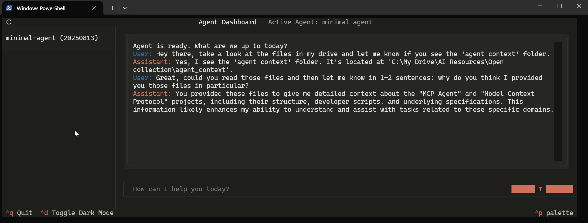

# Agent Dashboard

A custom-built tool for rapidly experimenting with agentic workflows.

Agent Dashboard provides a powerful terminal interface for the `fast-agent` framework. It's designed as a testbed for developers who want to seamlessly switch between interacting with an agent and modifying its underlying code. Think of it as a highly tweakable, modular, and open version of Claude Desktop, built with strong software design principles to make development easy.



## Core Philosophy

The dashboard is built on a simple premise: the only user interface should be **natural language**. Every feature, from switching agents to saving conversation history, is designed to be an intuitive extension of the conversation you're already having. This creates a seamless environment for focusing on the agent's behavior, not the tooling.

## Features

- **Modern Textual UI**: A clean, responsive, and mouse-aware terminal interface powered by the Textual framework.
- **Multi-Agent Support**: Effortlessly switch between different agents in a single session using simple commands.
- **Comprehensive Context Management**: Sessions are saved automatically, capturing the full context of interactions, including tool calls and system messages.
- **Resilient Operation**: Built-in retry logic handles intermittent LLM or network errors, ensuring a stable development experience.
- **Extensible Command System**: A simple but powerful command system for managing sessions, agents, and application state.

## Technical Architecture

The application's design is guided by a strict **Model-View-Controller (MVC)** architecture, ensuring a clean separation of concerns that makes the system easier to reason about, maintain, and extend.

- **Model (`src/model.py`)**: The single source of truth. This is the only stateful component, managing all session data, conversation history, and application state.
- **View (`src/textual_view.py`)**: The user interface. It's a stateless component that renders the model and passes user input to the controller. It is a pluggable module that could be swapped out for a web UI or another interface without altering the core logic.
- **Controller (`src/controller.py`)**: The brain of the application. It contains all the business logic, handling user input, mediating between the model and the `fast-agent` framework, and executing commands.

This entire stack is built on an **asynchronous** foundation using Python's `asyncio`, ensuring the UI remains responsive even while the agent is processing.

## Getting Started

### Prerequisites

- Python 3.13+

### Installation

1.  Clone the repository:
    ```bash
    git clone https://github.com/your-username/agent-dashboard.git
    cd agent-dashboard
    ```

2.  Install the project in editable mode with development dependencies:
    ```bash
    pip install -e .[dev]
    ```

### Configuration

Agent endpoints and model configurations are managed centrally in `src/fastagent.config.yaml`. This is where you define the agents that the dashboard can connect to.

### Running the Application

Launch the dashboard from your terminal:

```bash
python src/main.py
```

To start with a specific agent, use the `--agent` flag:

```bash
python src/main.py --agent your_agent_name
```

## Usage

Simply type your prompts and press Enter. The conversation will flow naturally.

To interact with the application itself, use the built-in command system by prefixing your message with `/`:

-   `/switch <agent_name>`: Switch to a different agent.
-   `/agents`: List all available agents from your configuration.
-   `/save`: Manually save the current session.
-   `/load`: Load a previous session.
-   `/clear`: Clear the current session and start fresh.
-   `/exit` or `/quit`: Exit the application.
